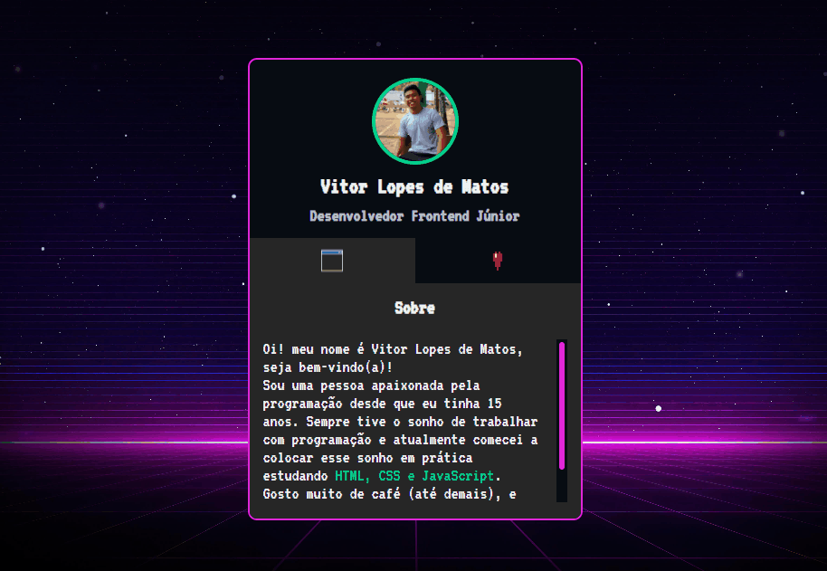

# PROJETO MINI-PORTIFÓLIO

Projeto criado no evento MAPA DEV WEEK do DevEmDobro, que
foi uma semana de imersão tecnológica para iniciantes, 
que tratava de assuntos referentes ao desenvolvimento
frontend. O seguinte projeto se trata de um mini-portifólio 
que possui uma imagem de perfil do usuário, uma página de sobre 
e outra de redes sociais. Foi desenvolvido no evento. Ficou muito bom!

### Imagem do Projeto

### Links

- URL do Site ao vivo: []
- URL do código no GitHub: []

## Meu processo

### Construído com

- Marcação semântica HTML5
- Propriedades personalizadas CSS
- Flexbox
- Linguagem de programação JavaScript

### Desenvolvimento contínuo

- Aprimorar ainda mais conhecimento em HTML e sua semântica.
- Aprimorar sobre as propriedades de CSS, principalmente flexbox e grid.
- Aprender a base do JavaScript.
- Ter conecimento do JavaScript avançado.
- Aprender e aperfeiçoar o framework React.
- Desenvolver técnicas que melhore meu status como profissional.
