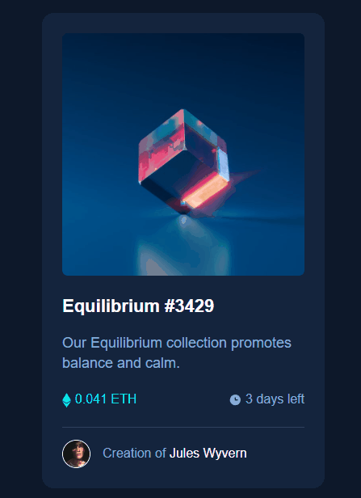

# Frontend Mentor - Solução de componente do cartão de visualização NFT

Esta é uma solução para o desafio [NFT de componentes do cartão de visualização no Frontend Mentor](https://www.frontendmentor.io/challenges/nft-preview-card-component-component-SbdUL_w0U). Os desafios do Frontend Mentor ajudam a melhorar suas habilidades de codificação construindo projetos realistas. 

## Visão geral

### O desafio

Os usuários devem ser capazes de:

- Veja o layout ideal dependendo do tamanho da tela do dispositivo
- Ver estados hover para elementos interativos

### Captura de tela
[]


### Links

- URL da solução: [https://github.com/vitorlopes523/nft-preview-card-component]
## Meu processo

### Construído com

- Marcação semântica HTML5
- Propriedades personalizadas CSS
- Flexbox

### O que eu aprendi

Um grande desafio que encontrei nesse projeto foi na estilização, para colocar como efeito hover uma cor de fundo e um icon em uma imagem, foi bastante trabalhoso, mas com a ajuda de terceiros consegui fazer o que era esperado, com certeza esse foi meu maior aprendizado nesse projeto.

''css
.nft-card .image-link::before {
  content: '';
  background-color: var(--primary-medium);
  width: 100%;
  height: 100%;
  position: absolute;
  opacity: 0;
  transition: 0.3s ease-in-out;
}

.nft-card .image-link::after {
  content: '';
  background: url('../imagens/icon-view.svg') no-repeat center;
  position: absolute;
  width: 100%;
  height: 100%;
  opacity: 0;
  transition: 0.3s ease-in-out;
}

.nft-card .image-link:hover::before {
  opacity: 0.4;
}

.nft-card .image-link:hover::after {
  opacity: 1;
}
```


### Desenvolvimento contínuo

Estou estudando a bastante HTML e CSS, ainda não tenho muito conhecimento em JavaScrip e React, mas pretendo estudar os mesmos para aplicar suas diretrizes em projetos futuros.


## Autor

- Site - [https://vitorlopes523.github.io/MaratonaExplore2/]
- Frontend Mentor - [@vitorlopes523](https://www.frontendmentor.io/profile/vitorlopes523)

## Reconhecimentos

Os irmãos Ricardo e Roberto da Guilda Dev em Dobro, e donos do curso de programação DevQuest na qual eu faço parte, foram grandes aliados na construção desse projeto, auxiliando por meio de dicas e correções de suma importância, agradeço a eles pela ajuda!.
[https://www.instagram.com/devemdobro/]